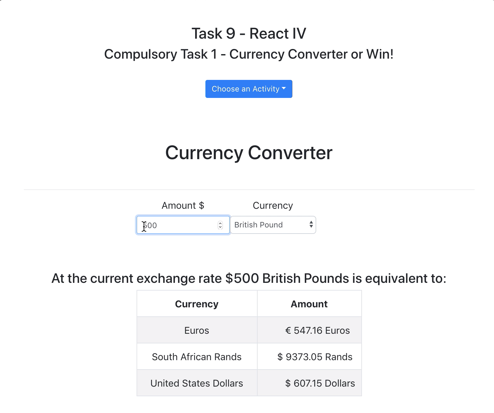
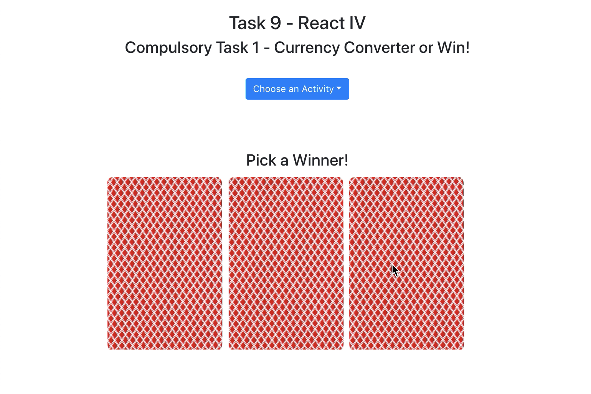
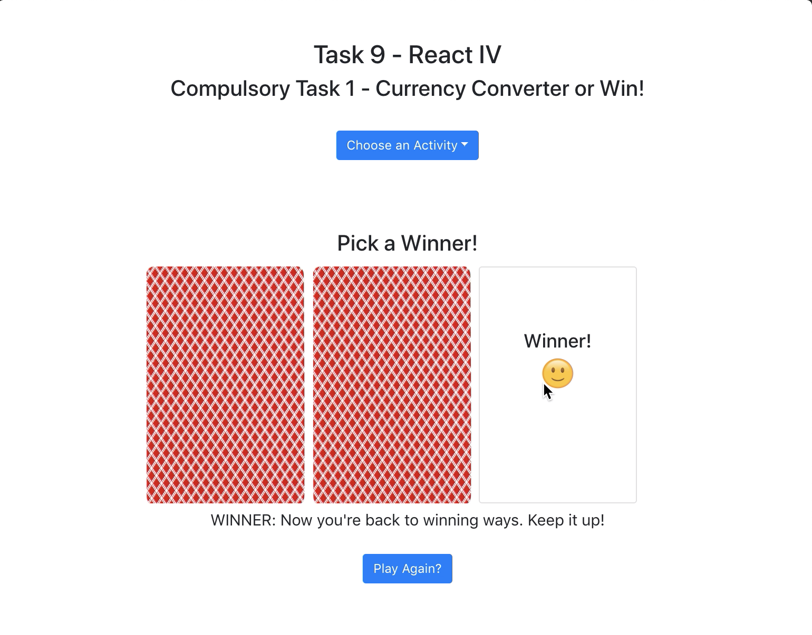

# ReactJS Project - Currency Converter and Three Card Monte

Currency Converter | Three Card Monte 1 | Three Card Monte 2
--- | --- | ---
 |  | 

This project was for the Full Stack Developer bootcamp I did and was for a lesson on managing state in ReactJS.

## The Assignment

> Create a React app that:
> * Contains a Dropdown that allows a user to select which functionality
they want to use on your site. The options should be ‘Currency
converter’ and ‘Win!’.
> * Contains a component that converts currencies. This component should be displayed when the user selects ‘Currency converter’ from the Dropdown. The user should be able to enter a figure in dollars and the app should calculate and display the amount in South African Rands, UK pounds and Euros. The components that display the converted values should be children of the conversion component.
> * Contains a component that allows the user to play a simple game. This component should be displayed when the user selects ‘Win!’ from the Dropdown. The user should be shown three ‘Card’ components that they can click. When the user clicks on a ‘card’ the card should be ‘turned’ to reveal a message which either indicates that they’ve won a prize or that they’ve lost. They should only be able to pick one ‘card’ with each try. Once they’ve picked a ‘card’ they should no longer be able to click the ‘cards’ but should either be able to ‘Try again’ or ‘Quit’. The winning card should be different each time.

<!-- ## The Solution
I have the code hosted for demo at Heroku. It may be a little slow to spin up but you can [see it here](https://dh4u-bootcamp-current-weather.herokuapp.com/). -->

## Running the Code Locally

[Clone / Download](https://github.com/dh4u/bootcamp-currency-converter-and-monte-game) the project to your computer.

### Start the code
Open command prompt / terminal for the project folder and then you can run:

#### `npm install`

This will install the node dependencies.

#### `npm start`

Runs the app in the development mode. 
Open [http://localhost:3000](http://localhost:3000) to view it in the browser.
 
 

***
###### This project was bootstrapped with [Create React App](https://github.com/facebook/create-react-app).
